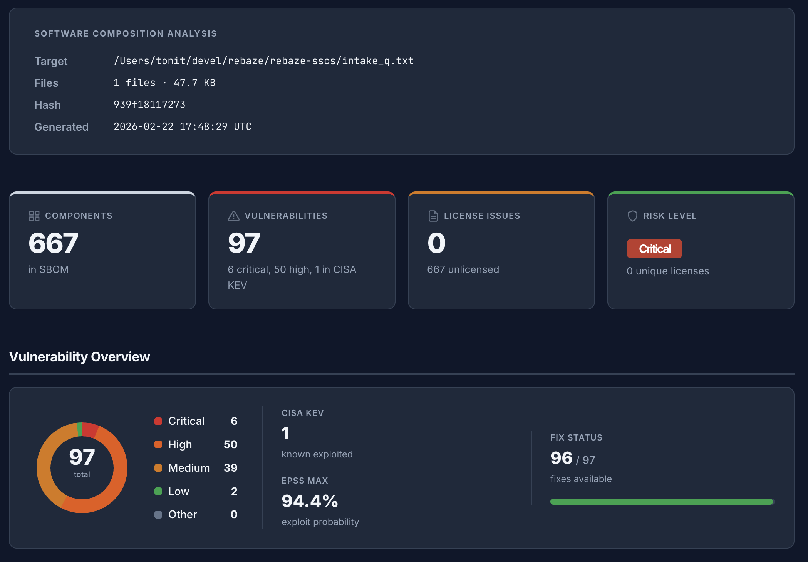
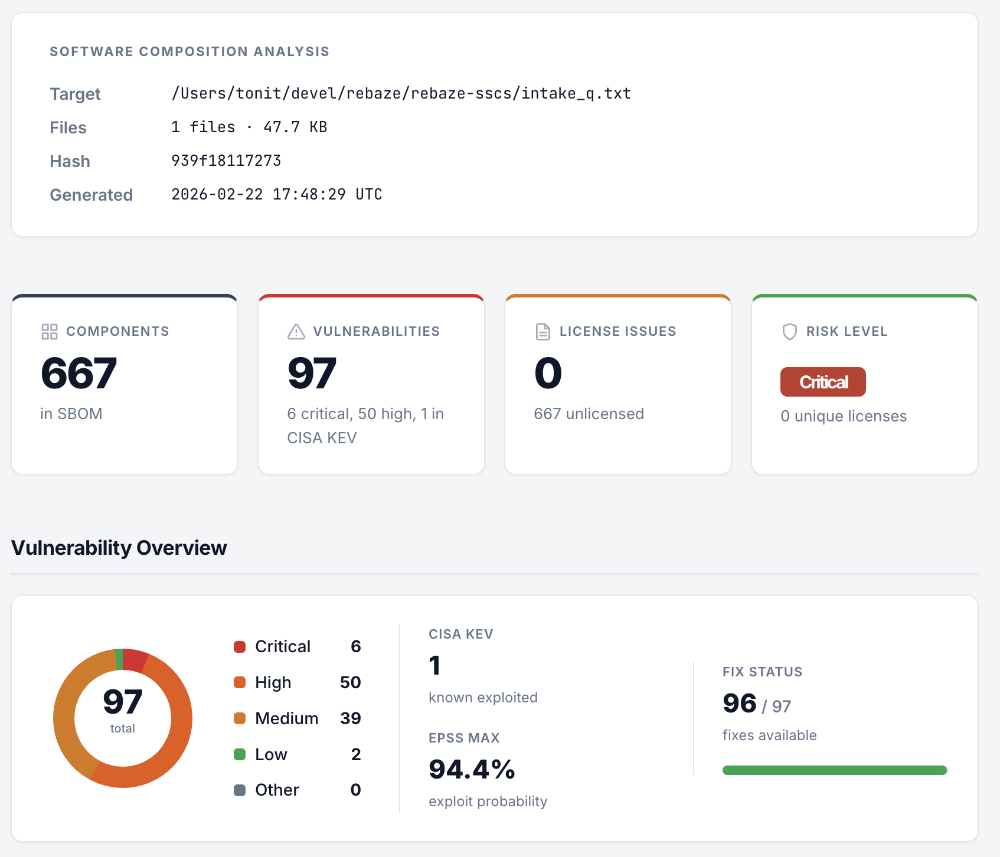

# scat

[](https://github.com/rebaze/scat/actions/workflows/ci.yaml)
[](https://github.com/rebaze/scat/actions/workflows/release.yaml)
[](https://github.com/rebaze/scat/releases/latest)
[](LICENSE)
[](go.mod)
[](https://scorecard.dev/viewer/?uri=github.com/rebaze/scat)

**Software Composition Analysis Tool** — that's what scat stands for.

One command that answers three questions: what's in your software, what's vulnerable, and what are the license obligations? Built for two audiences — AI agents that need structured data on stdout, and humans who want a visual dashboard. Both are first-class.

## For machines

AI agent? Run this:

    scat <target> --quiet -f markdown

Full SCA report — SBOM, vulnerabilities, licenses — as structured Markdown on stdout. No files written, no TUI, just data. Pipe it, parse it, feed it to your next step.

## For humans

    scat <target>

Opens an HTML dashboard with severity bars, risk heatmap, and license overview. One file, ready to share.




## For AI agents

Install the [Claude Code](https://claude.ai/code) skill to let AI agents use scat:

```bash
mkdir -p ~/.claude/skills/scat
curl -fsSL https://raw.githubusercontent.com/rebaze/scat/main/skill/SKILL.md \
  -o ~/.claude/skills/scat/SKILL.md
```

Once installed, Claude knows when and how to run scat on your projects.

## Features

- **CycloneDX SBOM** — industry-standard software bill of materials
- **Vulnerability scanning** — matches packages against known CVEs with severity scoring, enriched with EPSS exploit probability and CISA KEV (Known Exploited Vulnerabilities) data
- **License compliance** — detects and evaluates open-source licenses
- **HTML dashboard** — beautiful out-of-the-box light and dark mode report ready to share, with severity bars, risk heatmap, and print-friendly layout
- **Single binary** — no external tools required on PATH; Syft, Grype, and license checking are embedded as Go libraries

## Installation

### Homebrew (recommended)

```bash
brew install rebaze/tap/scat
```

### Go install

```bash
go install github.com/rebaze/scat@latest
```

### From source

```bash
git clone https://github.com/rebaze/scat.git
cd scat
make build    # injects version, commit, and build date via ldflags
```

## CLI Reference

```
scat <path>
```

There are no subcommands. Just point `scat` at a directory or PURL file.

### Flags

| Flag | Short | Default | Description |
|------|-------|---------|-------------|
| `--output-dir` | `-o` | `.` | Directory for output files |
| `--format` | `-f` | `html` | Output format: `html` (file), `markdown` (stdout) |
| `--verbose` | `-v` | `false` | Verbose output |
| `--quiet` | `-q` | `false` | Suppress non-error output |
| `--clear-cache` | | `false` | Delete the cached Grype vulnerability database before scanning |
| `--version` | | | Print version information |

## Output

Each invocation produces **one output** — the format flag determines both the shape and the destination:

| Format | Destination | TUI progress | Files created |
|--------|-------------|--------------|---------------|
| `html` (default) | `<prefix>-summary.html` in `--output-dir` | stdout | `<prefix>-summary.html` |
| `markdown` | stdout | stderr | none |

The `<prefix>` is the basename of the scanned folder (e.g. `my-project` for `/path/to/my-project`).

`--output-dir` only applies to HTML output. For Markdown, use shell redirection (`> file.md`) to write to a file — this is simpler and more composable than a dedicated flag.

When using `-f markdown`, the TUI progress bar is routed to stderr so it stays visible in the terminal while stdout carries clean Markdown suitable for piping.

### Examples

```bash
# Default: HTML dashboard
scat myproject
# → writes ./myproject-summary.html, TUI progress on terminal

# HTML to a specific directory
scat -o /tmp myproject
# → writes /tmp/myproject-summary.html

# Markdown to terminal
scat -f markdown myproject
# → TUI on stderr, Markdown on stdout

# Pipe to an LLM
scat -f markdown myproject | llm "summarize critical vulnerabilities"

# Save Markdown to a file
scat -f markdown myproject > report.md

# Quiet mode (no TUI)
scat -q myproject
scat -f markdown -q myproject

# Re-download vulnerability database
scat --clear-cache myproject

# Print version
scat --version
```

## Pipeline

```
  source folder
       │
       ▼
  scat <folder>              → <prefix>-summary.html   (default)
  scat -f markdown <folder>  → stdout                   (pipe-friendly)
```

## License

[Apache-2.0](LICENSE)
